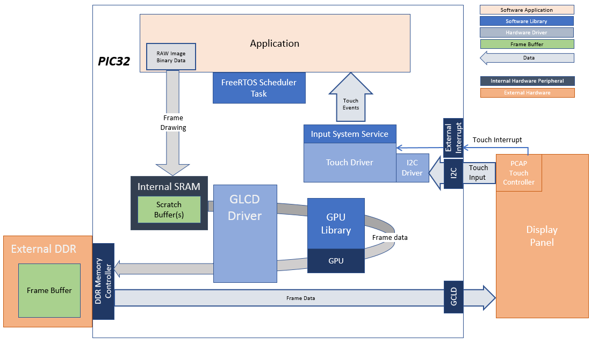

 blank\_quickstart\_mzda\_extddr\_sk\_meb2\_wqvga\_freertos.X

Defining the Architecture
-------------------------

In this configuration, the application calls directly into Graphics LCD (GLCD) driver set up and initialization calls that configure the GLCD. After the initialization phase, the application transitions into the paint phase, where it draws an image to the frame buffer. The application uses a gfx_driver API to get the start address of the frame buffer in external DDR and writes pixel data directly to the frame buffer memory address.

The GLCD hardware peripheral continuously refreshes the display panel with data from the frame buffer and the images are shown on the display.

### Demonstration Features

-   Graphics with FreeRTOS
-   GLCD display controller and NANO 2D GPU
-   32-bit RGBA Color Mode Frame Buffer in DDR memory
-   RLE compressed RGB image in internal flash

Creating the Project Graph
--------------------------

The Project Graph diagram below shows the Harmony components that are included in this application. Lines between components are drawn to satisfy components that depend on a capability that another component provides.

Adding the **PIC32MZ DA Starter Kit BSP** and **Legato Graphics w/ PDA TM4301B Display** Graphics Template component into the project graph will automatically add the components needed for a graphics project and resolve their dependencies. It will also configure the pins needed to drive the external peripherals like the display and the touch controller.

Building the Application
------------------------

The parent directory for this application is gfx/apps/blank\_quickstart. To build this application, use MPLAB X IDE to open the gfx/apps/blank\_quickstart/firmware/legato\_qs\_mzda\_extddr\_sk\_meb2\_wqvga.X project file.

The following table lists configuration properties:

|Project Name|BSP Used|Graphics Template Used|Description|
|:-----------|:-------|:---------------------|:----------|
|blank\_qs\_mzda\_extddr\_sk\_meb2\_wqvga\_freertos.X|PIC32MZ DA Starter Kit|Legato graphics w/ PDA TM4301b Display|Legato graphics on PIC32MZ DA with Internal DDR Starter Kit, MEBII and PDA TM4301b Display.|

> \*\*\_NOTE:\_\*\* This application may contain custom code that is marked by the comments // START OF CUSTOM CODE ... and // END OF CUSTOM CODE. When using the MPLAB Harmony Configurator to regenerate the application code, use the "ALL" merging strategy and do not remove or replace the custom code.

Configuring the Hardware
------------------------

The final setup should be:

Configure the hardware as follows:

-   On the MEB II, the EBIOE and LCD\_PCLK (J9) must be jumpered. A connection establishes the GLCD's pixel clock output timing. The external SRAM memory on the board is disabled. The jumper (J9) is available on the bottom side of the MEB II board under the starter kit. The J9 jumper is located on the bottom of the MEB II board, beneath where the starter kit is plugged into the board. Refer to the following image for the exact location.
-   Connect the PIC32MZ DA Starter Kit board to the MEB II board.
-   Power up the board by connecting the power adapter to J3 power connector on the MEB II board or a powered USB cable to the USB DEBUG port on the Starter Kit board

Connect the PIC32MZ DA Starter Kit to the MEB II board

Power up the board by connecting the power adapter to J3 power connector on the MEB II board or a powered USB cable to the USB DEBUG port on the Starter Kit board.

Running the Demonstration
-------------------------

Once the board is powered on, the application will run and show the following image on the display panel.

* * * * *

 
