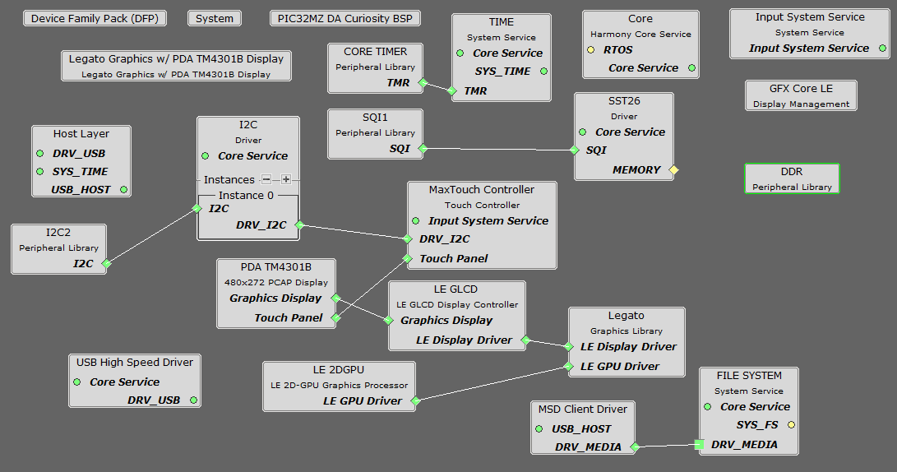
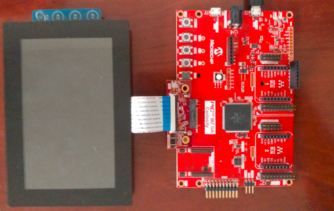
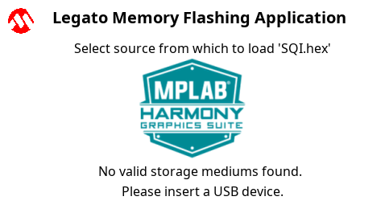

 legato_fl_mzda_cu_tm4301b.X

Defining the Architecture
-------------------------

This application uses the file systems in MPLAB Harmony and the USB or the SDMMC driver to scan the MSD for a .hex file with resources and reads them sector by sector and programs the external non-volatile QSPI memory. The Graphics Library is used to render graphics to the scratch buffer.  The GLCD peripheral is used to drive multi-layer, WQVGA graphics using DDR memory, to the display.

The USB is setup in MSD Host mode with the File System service support. It scans for a file named SQI.hex when a UBS MSD is connected. The application reads the hex data from the file and decodes it with a hex decoder into binary data. The binary is written to external non-volatile memory via the QSPI peripheral configured with the SST26 driver.

The application will prompt the user to insert a USB MSD containing the [Intel HEX Format](https://en.wikipedia.org/wiki/Intel_HEX) file to be flashed to the onboard SQI flash device.

Once a valid device and file have been identified the application will prompt the user to confirm they wish to flash the file.  A progress bar will then indicate the progress of the flashing process.

### Demonstration Features

-   Legato Graphics Library
-   24-bit color, multi-layer, WQVGA (480x272) screen design
-   Graphics Acceleration using integrated display controller (GLCD)
-   SQI Memory Interface
-   USB Interface
-   File System Interface
-   Touch Input

Creating the Project Graph
--------------------------

The Project Graph diagram below shows the Harmony components that are included in this application. Lines between components are drawn to satisfy components that depend on a capability that another component provides.

Building the Application
------------------------

The parent directory for this application is gfx/apps/legato_flash. To build this application, use MPLAB X IDE to open the gfx/apps/legato_flash/firmware/legato_fl_mzda_cu_tm4301b.X project file.

The following table lists configuration properties:

|Project Name|BSP Used|Graphics Template Used|Description|
|:-----------|:-------|:---------------------|:----------|
|legato_fl_mzda_cu_tm4301b.X|PIC32MZ DA Curiosity|Legato Graphics w/ PDA TM4301B Display|

> \*\*\_NOTE:\_\*\* This application may contain custom code that is marked by the comments // START OF CUSTOM CODE ... and // END OF CUSTOM CODE. When using the MPLAB Harmony Configurator to regenerate the application code, use the "ALL" merging strategy and do not remove or replace the custom code.

Configuring the Hardware
------------------------

The final setup should be:

Configure the hardware as follows:

-   Attach the 24-bit passthrough graphics interface card to the J601 connector on the PIC32MZ DA Curiosity board.
-   Connect the ribbon cable from the WQVGA display to the J2 connector on the 24-bit passthrough graphics interface card.
-   Power up the board by connecting a micro USB cable to the Debug USB connector or 9v power supply to the barrel plug

Running the Demonstration
-------------------------

Once the board is powered on, the application will run and show the following image on the display panel.

The application will specifically look for a file in [Intel HEX Format](https://en.wikipedia.org/wiki/Intel_HEX) called '**SQI.hex**'.  Connect a FAT32-formatted USB MSD device to the **Target USB** port.  If the device enumeration succeeded, the display will display a USB button.

Press and release the USB button. The application will initiate the data transfer on release of the button. Depending on the size of SQI.hex file (greater than 500 kilobytes), the application may freeze with no visual feedback, upwards of 30 seconds. It will then display a progress bar to indicate the transfer. The transfer completes when the progress bar is filled. The application will then display a button with **OK**.

* * * * *

 
