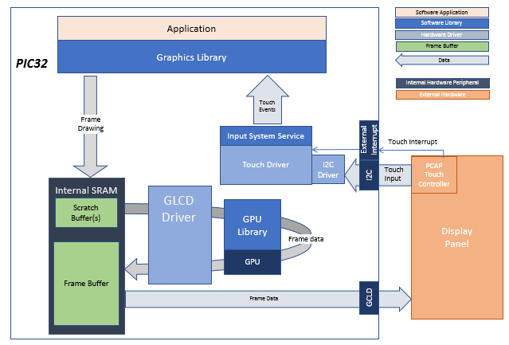

 legato\_quickstart\_mzda\_extddr\_sk\_meb2\_tm4301b.X

Defining the Architecture
-------------------------

This application demonstrates multi-layer, WQVGA graphics using internal SRAM only without the need for DDR memory.

User touch input on the display panel is received thru the PCAP capacitive touch controller, which sends a notification to the Touch Input Driver. The Touch Input Driver reads the touch information over I2C and sends the touch event to the Graphics Library thru the Input System Service.

### Demonstration Features

-   Legato Graphics Library and Graphics Canvas
-   Reference application for the PIC32MZ DAA/DAB devices with External DDR
-   24-bit color, multi-layer, WQVGA (480x272) screen design
-   16-bit RGB565 color depth support (65535 unique colors)
-   Graphics Acceleration using integrated display controller (GLCD)

Creating the Project Graph
--------------------------

The Project Graph diagram shows the Harmony components that are included in this application. Lines between components are drawn to satisfy components that depend on a capability that another component provides.

Adding the **PIC32MZ DA External DDR Starter Kit + MEB-II BSP** and **Legato Graphics w/ PDA TM4301b Display** Graphics Template component into the project graph will automatically add the components needed for a graphics project and resolve their dependencies. It will also configure the pins needed to drive the external peripherals like the display and the touch controller.

Building the Application
------------------------

The parent directory for this application is gfx/apps/legato\_quickstart. To build this application, use MPLAB X IDE to open the gfx/apps/legato\_quickstart/firmware/legato\_qs\_mzda\_extddr\_sk\_meb2\_tm4301b.X project file.

The following table lists configuration properties:

|Project Name|BSP Used|Graphics Template Used|Description|
|:-----------|:-------|:---------------------|:----------|
|legato\_qs\_mzda\_extddr\_sk\_meb2\_tm4301b.X|PIC32MZ DA External DDR Starter Kit + MEB-II|Legato Graphics w/ PDA TM4301b Display|PIC32MZ DA External DDR Starter Kit + MEB-II with RGBA8888 GFX Interface and 4.3" WQVGA PCAP Touch display|

> \*\*\_NOTE:\_\*\* This application may contain custom code that is marked by the comments // START OF CUSTOM CODE ... and // END OF CUSTOM CODE. When using the MPLAB Harmony Configurator to regenerate the application code, use the "ALL" merging strategy and do not remove or replace the custom code.

Configuring the Hardware
------------------------

The final setup should be:

Configure the hardware as follows:

- J9 jumper be set to provide the GLCD's pixel clock. Set the J9 jumper to connect EPIOE to LCD_PCLK. The J9 jumper is located on the bottom of the MEB II board, beneath where the starter kit is plugged into the board. Refer to the followin figure for the exact location. 

- Connect the PIC32MZ DA External Starter Kit board to the MEB II board 
- Power up the board by connecting the power adapter to J3 power connector on the MEB II board or a powered USB cable to the USB DEBUG port on the Starter Kit board 

The final hardware setup should be:

Running the Demonstration
-------------------------

When power-on is successful, the demonstration will display a similar menu to that shown in the following figure (different configurations may have slight variation in the screen aspect ratio):

* * * * *

